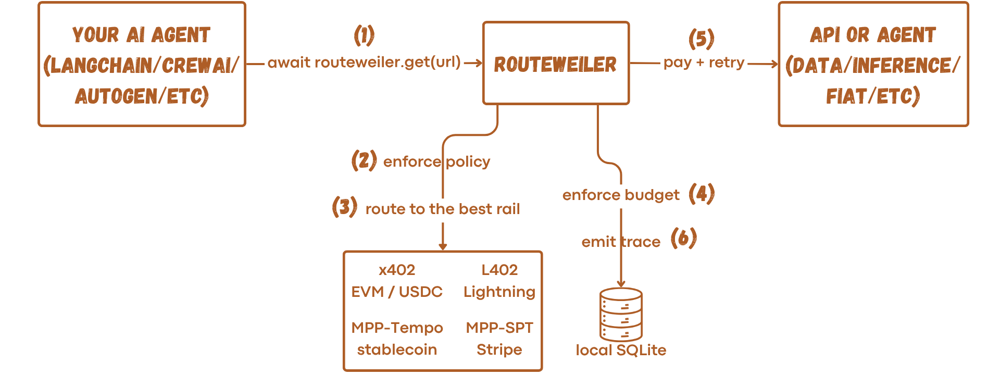

# routeweiler

<p align="center">
  
</p>

<p align="center">
  <a href="https://github.com/nikoSchoinas/routeweiler-python-sdk/actions/workflows/ci.yml?query=branch%3Amain"></a>
  <a href="LICENSE"></a>
  
  
  <a href="https://github.com/astral-sh/ruff"></a>
  
</p>

The neutral micropayment router for autonomous agents. A single async HTTP client —
`await routeweiler.get(url)` — that transparently handles `402 Payment Required` across
x402 (EVM), L402 (Lightning), MPP-Tempo (stablecoin), and MPP-SPT (Stripe).

<p align="center">
  
</p>

## Install

```bash
pip install routeweiler
```

Python 3.11+ required.

## Quick start

```python
import asyncio
import os
from eth_account import Account
from routeweiler import Routeweiler, Funding

signer = Account.from_key(os.environ["PRIVATE_KEY"])

async def main():
    async with Routeweiler(funding=[Funding.base_usdc(wallet=signer)]) as client:
        response = await client.get("https://api.example.com/data")
        print(response.json())

asyncio.run(main())
```

## Supported rails

| Rail | Method | Funding source | Networks |
|------|--------|---------------|----------|
| [x402](https://x402.org) | EVM signed transaction | `EvmFundingSource` | Base, Base-Sepolia |
| [L402](https://docs.lightning.engineering/the-lightning-network/l402) | BOLT-11 Lightning invoice | `LightningFundingSource` | Bitcoin, Regtest |
| [MPP-Tempo](https://paymentauth.org) | Tempo 0x76 stablecoin tx | `TempoFundingSource` | Moderato testnet |
| [MPP-SPT](https://docs.stripe.com/agentic-commerce) | Stripe Shared Payment Token | `StripeFundingSource` | USD, EUR, GBP |

## SQLite trace recorder

Enable local tracing with `TraceSink.sqlite`. Every call (paid or free) produces
exactly one `TraceEvent` row, including the on-chain tx hash and the payment outcome:

```python
from routeweiler import Routeweiler, Funding, TraceSink

async with Routeweiler(
    funding=[Funding.base_usdc(wallet=signer)],
    trace_sink=TraceSink.sqlite("./routeweiler.db"),
) as client:
    response = await client.get("https://api.example.com/data")

# Inspect with the sqlite3 CLI:
# sqlite3 ./routeweiler.db \
#   'SELECT request_id, selected_rail, http_status FROM trace_events;'
```

## Budget envelopes

Enforce per-session or per-agent spend caps with local SQLite budget envelopes.
Without a `budget_envelope`, tracing still works but **no cap is enforced**.

```python
from routeweiler import BudgetEnvelope, Funding, Routeweiler, TraceSink

async with Routeweiler(
    funding=[Funding.base_usdc(wallet=signer)],
    trace_sink=TraceSink.sqlite("routeweiler.db"),
    budget_envelope=BudgetEnvelope(
        id="session-abc",
        cap_minor_units=500,           # 5.00 USD (in cents)
        cap_currency="usd",
        allowed_rails=["x402", "l402"],
        ttl_seconds=3_600,             # 1 hour
    ),
) as client:
    response = await client.get("https://api.example.com/data")
```

`budget_envelope` accepts three forms:

- **`None`** (default) — no cap enforcement.
- **`str`** — ID of a pre-existing envelope; raises `EnvelopeNotFoundError` at
  construction time if the row is missing.
- **`BudgetEnvelope`** — declarative spec; If an envelope with the same `id` already exists it is reused unchanged.

Envelopes track reserved and settled amounts with Ed25519-signed draw receipts.
`BudgetExceededError` is raised if a payment would breach the cap.

## Policy

Control which rails are used, set per-call spend limits, or deny specific URLs:

```python
from routeweiler import Policy, PolicyRule, RuleMatch, Routeweiler

async with Routeweiler(
    funding=[...],
    policy=Policy(
        currency="usd",          # reference currency for max_per_call_minor_units
        rules=[
            PolicyRule(
                name="deny analytics",
                when=RuleMatch(url_matches="*.tracking.io"),
                deny=True,
            ),
            PolicyRule(
                name="cap per call",
                when=RuleMatch(url_matches="*"),
                max_per_call_minor_units=500,  # 5 USD cents
            ),
        ]
    ),
) as client:
    ...
```

`max_per_call_minor_units` requires a reference currency to compare rail-native quotes
against. Set `Policy(currency="usd")` (or any supported currency) when no
`budget_envelope` is configured — the envelope's `cap_currency` takes precedence when
both are present. If neither is provided and a rule uses `max_per_call_minor_units`,
`Routeweiler` raises `ValueError` at construction time.

## License

Apache 2.0 — see [LICENSE](../../LICENSE).
